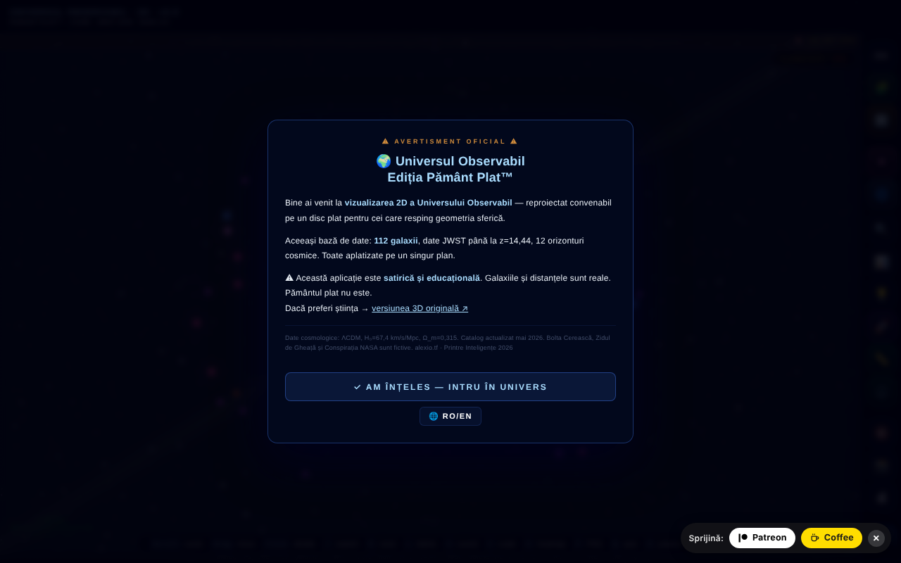

# Observable Universe 2D · v5.9 · Flat Earth Edition™

Harta 2D interactivă a universului observabil, pe scară logaritmică, cu 112 galaxii — în ediție satirică „Pământ Plat”.

**Live:** https://chiuta.github.io/Universul-Observabil-2D/

## Ce este

O aplicație single-file (`index.html`, canvas + JavaScript) care afișează universul observabil ca disc plat, pe scară logaritmică, cu 112 galaxii, orizonturi cosmice și date JWST (catalogul din aplicație este datat mai 2026; recordul afișat: MoM-z14, z=14.44). Ediția „Pământ Plat™” este umoristică/satirică, iar aplicația include și o secțiune care demontează teoria Pământului plat și una despre limitele simulării.

## Funcții

- Navigare: zoom (scroll, +/-), deplasare, reset vizualizare, anulare navigare (Z), meniu lateral.
- Straturi vizuale (etichete, grilă, inele, filamente, heatmap, grupuri gravitaționale, mod spectru etc.), cu corecții pentru daltonism (deuteranopie, protanopie, tritanopie, acromatopsie).
- Căutare galaxie, galaxie aleatoare, favorite (cu export CSV), export CSV al celor 112 galaxii.
- Tur ghidat, Quiz cosmic cu clasament local, „Puterile lui 10”, comparator de scară, ecran împărțit, simulare Andromeda, „Știai că…”, instrument de măsurare, statistici.
- Coloană sonoră adaptivă (Web Audio) cu activare/dezactivare și volum.
- Export PNG și imprimare; permalink cu starea completă (`#s=...`).
- Ghid integrat: Intro, Navigare, Straturi vizuale, Cronologia recordurilor de distanță, Pământ plat, Glosar, Întrebări frecvente, Limitele simulării, Istoric versiuni, Credite și surse.
- Interfață bilingvă română / engleză.

## Manual de utilizare

1. La prima vizită apare un tutorial scurt; îl poți omite („Skip tutorial”).
2. Navighează: scroll pentru zoom, trage pentru deplasare, **R** resetează, **Z** revine la poziția anterioară.
3. Deschide meniul ☰ sau folosește bara de sus pentru Căutare, Tur, Quiz, Powers×10, Scale, Andromeda, Split Screen, Did you know, Measure, Favorites, Stats, Random, Export PNG.
4. Taste: **/** căutare, **R** reset, **L** etichete, **S** sunet, **C** comparator de scară, **H** heatmap, **P** export PNG, **T** tur, **M** măsurare, **Q** quiz, **D** galaxie aleatoare, **F** favorite, **G** grupuri gravitaționale, **N** schimbă limba, **O** Powers of Ten, **X** ecran împărțit, **A** simulare Andromeda, **Z** anulează navigarea, **`** meniu lateral, **?** lista scurtăturilor, **Esc** închide panourile.
5. Limba: tasta **N** sau butonul RO/EN.
6. Daltonism: alege modul din panoul de straturi (Normal, Deuteranopia, Protanopia, Tritanopia, Achromatopsia).
7. Salvare: stea ⭐ pentru favorite, „⬇ Export favorites CSV”, „⬇ Export CSV (112 galaxies)” sau „📸 Export PNG”.

## Confidențialitate și rețea

- **Stocare locală:** `localStorage` — `uv_lang` (limba), `uv2d_favs` (favorite), `uv2d_prefs_v1` (preferințe: daltonism, straturi, sunet, volum), plus scorurile quiz-ului; `sessionStorage` — `tut_done`, `uv_eventGreetingShown`. Aplicația afirmă că nimic nu este trimis unui server (nu are backend).
- **Service worker:** codul pentru un service worker din blob există în fișier, dar browserele resping înregistrarea unui service worker din `blob:`; în practică este inactiv. Aplicația funcționează offline pentru că este un singur fișier local, nu datorită cache-ului.
- **Rețea:** nu am găsit apeluri `fetch` de date către servicii terțe. Linkurile către alexio.tf, ares.org.ro, Patreon, Buy Me a Coffee, Wikipedia, ADS și ESA Sky se deschid doar la click. Meta-etichetele (Open Graph, imagine de previzualizare) indică alexio.tf, fără efect la rulare.

## Notă: ediție satirică

Ediția „Pământ Plat™” este satirică. Elementele Bolta Cerească, Zidul de Gheață, „Conspirația NASA" și Broasca Țestoasă Spațială sunt fictive; galaxiile și distanțele sunt cele din catalog. Pe lângă avertismentul de la deschidere, pagina afișează acum permanent, în bara de sus (inclusiv pe mobil), eticheta „SATIRĂ · SATIRE".

## Date și surse
Afirmațiile „record” (MoM-z14, z = 14,44) sunt valabile **la data catalogului (mai 2026)** și pot fi depășite. Sursă: Naidu et al., arXiv:2505.11263 (preprint mai 2025; publicat în Open Journal of Astrophysics, ianuarie 2026). Intrarea EGS-z11-R0 (martie 2026, arXiv:2603.15841) nu a fost verificată independent. Distanțele sunt valori aproximative din catalogul aplicației (ΛCDM, Planck 2018), cu scop educațional. Referința de citare nu mai conține un DOI (aplicația nu are încă unul). Bibliografie per galaxie: în curs de completare.

## Rulare locală / offline

Descarcă `index.html` și deschide-l în browser; funcționează fără internet. Aplicația rămâne funcțională fără internet (service worker-ul din blob este inactiv).

## Licență

CC0 1.0 Universal (domeniu public) — vezi fișierul LICENSE

## Audit

Audit: 2026-10-10 — singurul `fetch` din fișier este în service worker-ul din blob (cache GET, same-origin; CSP `connect-src 'self'`); nu există apeluri de date către terți. Satira este semnalată explicit la prima deschidere („satirical and educational… The flat Earth is not"). Datele din catalog (inclusiv recordul JWST MoM-z14, z=14.44) provin din conținutul autorului și nu au fost verificate independent în acest audit. Corecturi de accesibilitate: viewport (zoom permis), etichete pentru sliderele de filtrare.

## Drepturi și atribuire
Aplicația și codul aparțin autorului (CC0 1.0, vezi `LICENSE`). Datele astronomice provin din publicații și cataloage publice; drepturile asupra materialelor terțe aparțin titularilor, iar dedicarea CC0 nu le acoperă. Dacă ești titular de drepturi sau persoană menționată și dorești corectarea sau retragerea, scrie la alexio@trom.tf; răspundem în 7 zile.

## Autor

Alexio — Alexandru-Ionuț Chiuță, contact: alexio@trom.tf. Aplicația îl creditează pe autor împreună cu ARES (ares.org.ro) și Centrul StrING.

## English summary

A single-file interactive 2D map of the observable universe on a logarithmic scale with 112 galaxies, JWST data (catalog dated May 2026), tour, quiz with local leaderboard, Powers of Ten, split screen, Andromeda simulation, colour-blind modes, CSV/PNG export and a satirical "Flat Earth Edition" with a built-in guide. Bilingual RO/EN. Preferences stored in localStorage; no data requests to third parties. CC0.

Rundă 3: 2026-10-11 — formulări „la data catalogului”, DOI-ul placeholder eliminat din ghid, etichete bilingve pentru sliderele de filtrare.
